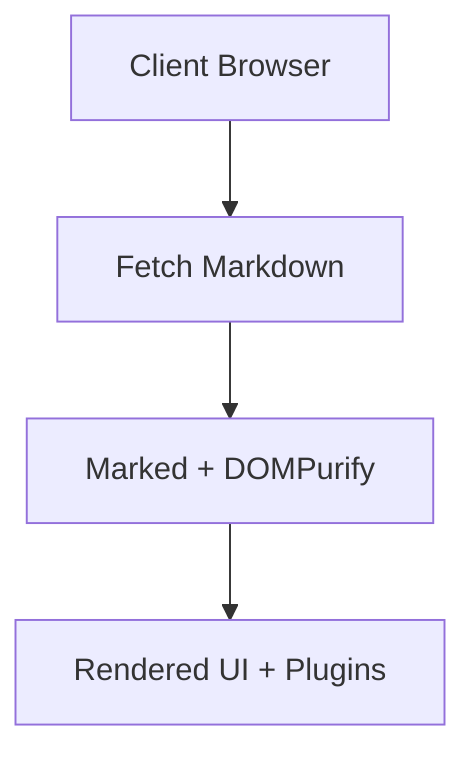

# Authoring Guide: Writing in VertiWiki

This guide covers all formatting, syntax, and features available when writing content in VertiWiki.

---

## 🏷️ Document Frontmatter (Jekyll / Astro Style)

You can add an optional YAML frontmatter block at the very top of any `.md` file to configure page metadata, authors, and AI discovery tags:

```markdown
---
title: My Guide Title
description: A concise summary of this guide used for search and AI answer engines.
author: Jane Doe
date: 2026-08-29
category: Architecture
tags: [setup, typescript, vite]
theme: terracotta
---

# My Guide Title
Document content starts here...
```

### What VertiWiki does with Frontmatter:
* **Zero Build**: Everything is parsed dynamically in the browser at runtime!
* **AEO & SEO**: Automatically generates Schema.org `TechArticle` JSON-LD data and OpenGraph tags.
* **Per-Page Theme**: You can force a specific theme palette on a single page using `theme: emerald` or `theme: terracotta`.
* **Automatic Fallback**: If you do not write frontmatter, VertiWiki automatically deduces the title from the first `#` heading and the description from the first paragraph!

---

## 📝 Markdown Basics & GFM

VertiWiki supports full **CommonMark** and **GitHub Flavored Markdown (GFM)** specifications.

### Headings
```markdown
# Heading 1 (Document Title)
## Heading 2 (Major Section)
### Heading 3 (Subsection)
```
Each heading automatically generates an anchor link (`#section-name`) accessible in the Table of Contents and permalink hover icon `#`.

### Lists & Task Lists
```markdown
* Unordered item 1
* Unordered item 2
  * Sub-item

1. Ordered step 1
2. Ordered step 2

- [x] Completed task
- [ ] Incomplete task
```

---

## 📁 Subfolders & Relative Linking

You can organize your files in subdirectories at any depth. VertiWiki automatically resolves all relative links:

```markdown
<!-- Link to a file in the same directory -->
[Getting Started](installation.md)

<!-- Link to a file in a sibling directory -->
[Configuration](../advanced/configuration.md)

<!-- Link to a file in the root directory -->
[Home](../../index.md)

<!-- Link to a specific heading section -->
[Step 2 Details](../advanced/configuration.md#step-2)
```

### Local Images in Subfolders
Relative images are automatically resolved relative to the Markdown file's location:
```markdown


```

---

## 🔗 Fast Cross-Referencing with Wikilinks (`[[...]]`) :badge[Core Plugin]{type=primary}

VertiWiki supports double-bracket Wikilinks for rapid cross-referencing between documents:

```markdown
* Basic link: [[features]]
* Link with alias: [[features|Explore All Features]]
* Link with anchor: [[math_diagrams#mermaid|Mermaid Diagrams]]
* Subfolder link: [[docs/guides/wikilinks|Wikilinks Guide]]
```

For the complete specification and Obsidian vault compatibility, see the [Wikilinks Guide](wikilinks.md).

---

## 📢 Callout Alerts (GitHub Style)

Create highlighted cards for notes, tips, warnings, and cautions:

```markdown
> [!NOTE]
> Helpful context and background information.

> [!TIP]
> Best practices, optimization tips, and recommendations.

> [!IMPORTANT]
> Crucial instructions that users must follow.

> [!WARNING]
> Breaking changes or potential caveats.

> [!CAUTION]
> Dangerous operations that could cause data loss.
```

---

## 💻 Code Blocks & Syntax Highlighting

Code blocks include syntax highlighting and an automatic copy-to-clipboard button:

````markdown
```typescript
interface WikiConfig {
  title: string;
  themePreset: string;
}

const config: WikiConfig = {
  title: "VertiWiki",
  themePreset: "terracotta"
};
```
````

---

## 📐 Mathematical Equations (KaTeX)

### Inline Math
Write `$E = mc^2$` or `$a^2 + b^2 = c^2$` inline with text.

### Block Math
```markdown
$$
\int_{-\infty}^{\infty} e^{-x^2} dx = \sqrt{\pi}
$$
```

---

## 📊 Mermaid.js Diagrams

Embed interactive flowcharts, sequence diagrams, and class diagrams directly:

````markdown

````

---

## 🎥 Video Embeds

Paste any standard YouTube or video URL on a single line, and VertiWiki embeds a responsive player:

```markdown
https://www.youtube.com/watch?v=dQw4w9WgXcQ
```

---

## 📑 Code & Content Tabs

Group multiple code examples or installation steps into tabbed switchers:

````markdown
::: tabs
== npm
```bash
npm install vertiwiki
```
== pnpm
```bash
pnpm add vertiwiki
```
== yarn
```bash
yarn add vertiwiki
```
:::
````

---

## 📂 Collapsible Details & FAQ Accordions

Create collapsible accordion blocks for FAQs or long reference data:

```markdown
::: details How do I change the default theme?
You can change the theme in `config.json` via `"themePreset": "emerald"`.
:::

::: details:open Initially Open Accordion
This accordion is expanded by default because of the `:open` modifier.
:::
```

---

## 🗂️ Subfolders & Automatic Directory Indexing

VertiWiki includes smart path resolution for nested folder structures:

### 1. Relative Markdown Links
Write standard relative markdown links — VertiWiki automatically rewrites them into client hash routes:
```markdown
[Read Installation Guide](../getting-started/installation.md)
[Sub-topic Guide](./sub-docs/index.md)
```

### 2. Automatic Directory Indexing (`index.md`)
When linking to a directory or navigating directly:
* Accessing `#/docs/sub-docs/` automatically resolves and loads `docs/sub-docs/index.md`.
* Accessing `#/docs/sub-docs` (extensionless) will automatically attempt to load `docs/sub-docs/index.md` with graceful fallback to `docs/sub-docs.md`.

