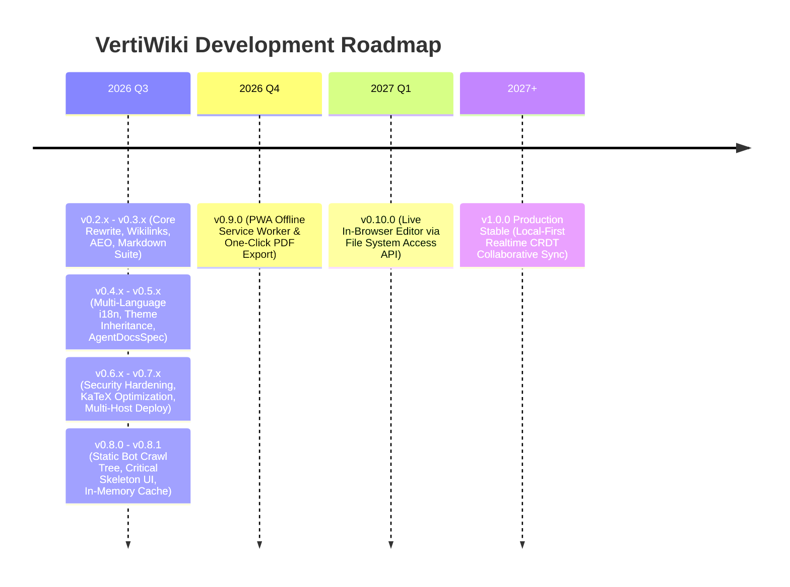

# Versioning Policy & Future Roadmap

This document outlines the versioning strategy, historical changelog, and future development roadmap for **VertiWiki**.

---

## 🏷️ Versioning Strategy

VertiWiki adheres strictly to **Semantic Versioning 2.0.0 (SemVer)**:
`MAJOR.MINOR.PATCH`

* **MAJOR (`v1.0.0`, `v2.0.0`)**: Incompatible architectural rewrites or breaking API changes.
* **MINOR (`v0.2.0`, `v0.3.0`)**: Backward-compatible new features, new plugins, new theme presets, or config extensions.
* **PATCH (`v0.2.1`, `v0.2.2`)**: Backward-compatible bug fixes, security patches, and performance optimizations.

---

## 📜 Version History

### **v0.9.2** (Current Active Release — September 2026) :badge[Latest]{type=success}
* 🐛 **Mermaid Diagram `<foreignObject>` Label Preservation**: Updated DOMPurify profile to preserve HTML nodes and labels in Mermaid SVGs.
* 🕶️ **AI Agent Directive UI Suppression**: Modern CSS `:has()` rules hiding `llms.txt` directives from human browser viewports while keeping them 100% visible to AI agents.
* 🤖 **AFDocs Universal Config**: Integrated `agent-docs.config.yml` with `urlPathPattern: md` for native Markdown scorecards.
* 🌐 **Vercel Content Negotiation Fix**: Corrected regex escaping in `vercel.json` for `Accept: text/markdown` header routing.

---

### **v0.9.1** (September 2026)
* 🐛 **Subfolder & Localized Wikilinks**: Relative path traversal computation (`../`) resolving cross-folder and localized (`ro/`, `fr/`) wikilinks.

---

### **v0.9.0 "Ichi"** (September 2026)
* 🏛️ **Modular Layout Engine (`data-layout`)**: Extensible layout modes (`default`, `book`, `handbook`, `api`, `hub`).
* 📖 **Readable Prose Width (`contentWidth: "readable"`)**: 68ch line length with relaxed 1.8 line-height.
* 🎨 **Decoupled Theme Architecture**: Lightweight core preset with standalone JSON themes in `themes/`.
* 📑 **Synchronized Tabs**: Cross-page tab state persistence in `localStorage`.

---

### **v0.8.4** (September 2026)
* 🔄 **Universal Human Browser Redirection & Content Negotiation**: Multi-cloud deployment recipes for Vercel, Cloudflare, Netlify, Nginx, and Apache.

---

### **v0.8.3** (September 2026)

---

### **v0.8.2** (September 2026)
* 🤖 **AgentDocsSpec (AFDocs) Compliance**: Fully compliant in-page AI agent directives (`.verti-agent-directive`) with `<a href="./llms.txt">/llms.txt</a>`.
* ⚡ **Deployment Content Negotiation**: Direct routing for `/docs` and `/docs/` when requesting `Accept: text/markdown`.
* 🛡️ **Automated AEO Tests**: Regression tests validating regex compatibility against the AgentDocsSpec standard.

---

### **v0.8.1** (September 2026)
* ⚡ **Adaptive Critical Skeleton UI**: Zero-FOUC inline skeleton screen with theme-adaptive styles (`prefers-color-scheme`) eliminating flash-of-unstyled-content while maintaining 0 CLS.
* 🚀 **In-Memory Cache & Parallel Fetch**: Instant 0 ms subsequent navigation transitions and parallelized `Promise.all` fetching.
* 🛡️ **Search Engine Crawl Landmark**: Standard accessible `.verti-sr-only` bot crawl tree protecting Google/Bing indexability without cloaking penalties.

---

### **v0.8.0** (September 2026)
* 🌳 **Static Bot Crawl Tree Engine**: Built-in semantic HTML tree generator producing valid anchor links to resolve Google Search Console's "Discovered - currently not indexed" issue on client SPAs.
* 🔀 **Query Parameter Routing**: Dynamic search query parameter routing (`?page=`, `?p=`, `?doc=`) and HTTP Content Negotiation (`Accept: text/markdown`).
* 📋 **Production Hosting Recipes**: Ready-to-use recipes in `deploy/` for Vercel, Netlify, Cloudflare Workers, Nginx, Apache, and AWS CloudFront.

---

### **v0.7.0** (September 2026)
* 🛡️ **Core Security Hardening**: Centralized HTML escaping, DOMPurify sanitization on SVG Mermaid diagrams, and iframe source origin validation.
* ⚡ **KaTeX Font Optimization**: WOFF2 font pruning reducing CSS payload by 73% and bundle size from 5.13 MB to 4.02 MB.
* 🧹 **Design System Standards**: Complete purge of legacy namespaces (`cortex-*`, `omni-*`) in favor of pure `.verti-*`.

---

### **v0.6.3** (September 2026)
* 🐞 **Directory Trailing Slash Normalization**: Automated edge 308 redirects and router path defense preventing address bar corruption.

---

### **v0.6.2** (September 2026)
* 🌐 **Universal Portability**: Fully path-agnostic relative asset resolution supporting root, subfolders, and offline `file:///`.

---

### **v0.6.1** (September 2026)
* 🐞 **Universal Progressive Enhancement Favicons**: Inlined Data URI favicons and Apple touch icons for reliable rendering in standalone bundles.

---

### **v0.6.0** (September 2026)
* 📁 **Subfolder Content Roots & Isolated Demo Fixtures**: Engine source decoupled from demo markdown in `demo/`.
* 🧪 **Comprehensive Automated Unit Testing**: Expanded test suite to 18 suites and 96 tests with Vitest.

---

### **v0.5.1** (September 2026)
* 🐞 **Mermaid Diagrams Contrast Harmonization**: Theme-aware SVG diagrams with guaranteed >10:1 contrast on dark themes.

---

### **v0.5.0** (September 2026)
* 🎨 **Custom Theme Inheritance (`extends`)**: Flexible inheritance chain from built-in presets or standalone JSON themes.
* 🤖 **AgentDocsSpec Discovery Directives**: Injected `<meta name="agent-docs">` and configurable `llmsTxtUrl`.

---

### **v0.4.1** (September 2026)
* 🐞 **Localized Navigation Link Resolution**: Resilient relative link resolution and active accordion state preservation on language switch.

---

### **v0.4.0** (August 2026)
* 🌐 **Native Multi-Language (i18n) & Mirror Architecture**: Zero-backend multi-language support, header globe switcher, and locale-scoped search.

---

### **v0.3.0** (August 2026)
* 🔗 **Native Wikilinks (`[[...]]`)**: Direct double-bracket page linking, custom aliases (`[[page|alias]]`), deep anchors (`[[page#section]]`), and Obsidian/Logseq vault compatibility.
* 🛡️ **Code Block Protection**: Automatic isolation of fenced code blocks and inline code spans during wikilink compilation.
* 📚 **Synchronized Documentation**: Added dedicated Wikilinks guide, interactive feature demos, and updated sitemaps.

---

### **v0.2.8** (August 2026)
* 🗂️ **Automatic Directory Indexing**: Seamless resolution of `#/docs/sub-docs/` to `docs/sub-docs/index.md` with sibling fallback.

---

### **v0.2.7** (August 2026)
* 🔀 **Path Hash Routing Migration**: Standardized modern URL routing (`#/path/to/page.md`) with anchor linking.

---

### **v0.2.6** (August 2026)
* 🐛 **HTML & Badge Sanitization**: Guaranteed plain-text sanitization for document titles and metadata, stripping visual badge spans from tab titles, OpenGraph, and TOC headings.
* 🔗 **Integrated Brand Link**: Embedded primary `https://verti.wiki` project link directly into the footer.

---

### **v0.2.5** (August 2026)
* 🏷️ **Static HTML Title vs. Dynamic Configuration**: Clarified client-side dynamic `config.title` vs. raw static `<title>` tag fallback in deployment and SEO guides.
* 📚 **Synchronized Documentation Standards**: Aligned documentation protocols for dual-repository distributions.

---

### **v0.2.4** (August 2026)

---

### **v0.2.3** (August 2026)
* 🎨 **Modular External Theme Files**: Custom themes can now live in dedicated `.json` files in `themes/` (e.g. `themes/obsidian.json`) and referenced in `config.json`.
* 🧹 **Streamlined `config.json`**: Reduced configuration footprint from 70+ lines to ~20 lines.
* ⚡ **Polymorphic Theme Loader**: Asynchronously resolves external theme files, single file path strings, and legacy inline theme objects with robust fallback handling.
* 🛡️ **Pure `verti-` Namespace**: Unified prefix across all CSS variables (`--verti-*`), DOM containers (`#verti-app`), UI components, and all 13 plugins.

---

### **v0.2.2** (August 2026)
* ⚡ **Flexible Brand Header**: Support for logo-only, text-only, or both logo and title in header via `brandDisplay: "both" | "logo" | "title"`.
* 📂 **Collapsible Sidebar Accordions**: Smart accordion folders in navigation tree with auto-expansion of active article branch (`collapsibleNavigation: true`).
* 🎨 **Obsidian Framework Theme**: Full support for custom zero-recompile themes with dynamic Google Fonts injection.
* 🌐 **Product Landing Showcase**: Standalone developer landing page and distribution suite in `website/`.

---

### **v0.2.1** (August 2026)
* 📑 **Interactive Code Tabs**: Added `::: tabs` and `::: code-group` multi-language switchers.
* 📂 **Collapsible Details & FAQs**: Added `::: details` accordion blocks.
* 🔍 **Image & Diagram Lightbox**: Fullscreen zoom modal on image click.
* 🔀 **Prev / Next Article Navigation**: Auto-generated sequential reading cards.
* 🤖 **Dynamic Zero-Build AEO Engine**: In-memory Schema.org JSON-LD graph generation (`TechArticle`, `BreadcrumbList`, `WebSite`).
* 📝 **Jekyll / Astro Style Frontmatter**: Native YAML metadata support with automatic smart fallback deduction.
* ⚡ **1-Click "Copy for AI" Action**: Context exporter for ChatGPT, Claude, and Perplexity prompts.
* 📊 **Universal Multi-Provider Analytics**: Dynamic zero-recompile tracking for GA4, GTM, Plausible, Cloudflare, Umami, and Matomo.
* 🏷️ **Badges & Tags Plugin**: Added `:badge[Text]{type=...}`.
* 📄 **Standard `llms.txt` & AI `robots.txt`**: Discovery index for LLM crawlers.

---

### **v0.2.0** (August 2026)
* ⚡ **Complete Architecture Rewrite**: Greenfield modern rewrite with **Vite 6, TypeScript 5.7+, Node 22+**, and ESM.
* 📦 **Single-File Distribution**: Bundles into standalone `dist/vertiwiki.html`.
* 🛡️ **Zero-XSS Guarantee**: Strict sanitization with **DOMPurify**.
* 🎨 **Multi-Theme Engine**: 7 presets (Warm Terracotta, Forest Emerald, Nord, Dracula, Amethyst, Editorial, Modern Indigo).
* 📁 **Subfolder & Hierarchical Support**: Automatic relative path calculation and dynamic breadcrumbs.
* 🔍 **Instant Full-Text Offline Search**: Client-side indexer with fuzzy matching (**MiniSearch**).
* 📐 **KaTeX & Mermaid.js**: Built-in math formulas and interactive diagrams.

---

## 🗺️ Development Roadmap

