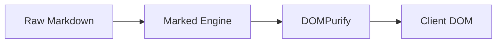

# Modern Features & 14 Built-in Plugins :badge[v0.9.2]{type=primary} :badge[Interactive Demo]{type=success}

> For the complete documentation index and agent navigation, see [llms.txt](demo/llms.txt).

VertiWiki includes **14 built-in zero-dependency plugins** that transform pure Markdown into a dynamic, rich documentation application directly in the browser.

---

## 1. 📢 GitHub Flavored Alerts & Callouts

> [!NOTE]
> Informational context and helpful design background.

> [!TIP]
> Best practices, optimizations, and pro-tips.

> [!IMPORTANT]
> Essential instructions and required prerequisites.

> [!WARNING]
> Deprecation notices, security warnings, or configuration alerts.

> [!CAUTION]
> High-risk actions that could cause data loss or service disruption.

---

## 2. 📑 Interactive Code & Language Tabs

::: tabs
== TypeScript
```typescript
interface WikiConfig {
  title: string;
  enableSearch: boolean;
  locales: LocaleConfig[];
}
```
== Python
```python
def get_wiki_config() -> dict:
    return {"title": "VertiWiki", "search": True, "locales": ["en", "fr", "ro"]}
```
== Bash
```bash
# Build standalone bundle
npm run build
```
:::

---

## 3. 📂 Collapsible Details & FAQs

::: details How does zero-backend client rendering work?
When a route changes, VertiWiki fetches the raw `.md` file using client-side `fetch()`, processes it through the plugin pipeline and `Marked`, sanitizes the HTML via `DOMPurify`, and injects the resulting DOM into the page in less than 15 milliseconds.
:::

::: details Can VertiWiki run completely offline?
Yes. The single standalone `vertiwiki.html` contains all scripts, fonts, stylesheets, KaTeX equations, and syntax tokenizers embedded in one file.
:::

---

## 4. 🏷️ Inline Badges & Pills

* :badge[v0.8.3]{type=primary} Core Release
* :badge[Success]{type=success} Fast GPU Render
* :badge[Warning]{type=warning} Deprecated
* :badge[Error]{type=error} Failed Check
* :badge[Purple]{type=purple} AEO Ready
* :badge[Info]{type=info} General Metadata

---

## 5. 📐 KaTeX Mathematical Equations

Inline equation: $E = mc^2$ and the Gaussian integral:

$$\int_{-\infty}^{\infty} e^{-x^2} dx = \sqrt{\pi}$$

---

## 6. 📊 Mermaid Flowcharts & Sequence Diagrams



---

## 7. 🔗 Bidirectional Wikilinks (`[[...]]`)

Interlink articles seamlessly with Obsidian and Logseq vault compatibility:

* Cross-link directly: [[themes|Themes & Palettes]]
* Jump straight to section: [[math_diagrams#mermaid|Mermaid Diagrams]]
* Link across subdirectories: [[docs/guides/wikilinks|Complete Wikilinks Guide]]

---

## 8. 🔍 Image & Diagram Lightbox Zoom

Click on any image to open it in a full-screen, high-resolution **Lightbox modal** with dark blurred backdrop:


---

## 9. 🌐 Native Multi-Language (i18n) & Mirror Folders

Serve multilingual wikis with mirror subfolders (`fr/`, `ro/`, etc.) and dynamic header language switcher:

* Switch languages using the **🌐 Globe Dropdown** in the header
* Read the technical setup in [[docs/guides/multi-language|Multi-Language Guide]]

---

## 10. ⚡ MiniSearch Client-Side Full-Text Search

Press `⌘K` or `/` anywhere to launch instant, fuzzy full-text search with automatic locale scoping.

---

## 11. 🧭 Dynamic Table of Contents (TOC) & Scrollspy

The right sidebar automatically extracts H2–H4 headings and tracks current scroll position with active highlights using `IntersectionObserver`.

---

## 12. 🌲 Auto-Expanding Sidebar Navigation Accordion

Collapsible navigation groups in the left sidebar automatically expand to reveal and highlight the currently active document.

---

## 13. 🔀 Previous & Next Sequential Reading Cards

Every article automatically computes sequential reading navigation cards at the bottom of the page based on `navigation.md`.

---

## 14. 🤖 Answer Engine Optimization (AEO) & Agent-Friendly Docs

* **AgentDocsSpec Discovery Directive**: Injects a visually-hidden, screen-reader accessible directive at the top of the DOM for AI coding agents (`llms-txt-directive-html`), pointing directly to the documentation index and raw Markdown files.
* **Configurable LLM Index**: Customize or disable the LLM index path via `"llmsTxtUrl": "/llms.txt"` in `config.json` (or set to `null` to disable).
* **Dynamic JSON-LD Graphs**: Automatically generates Schema.org `TechArticle` and `BreadcrumbList` graphs in `<head>` on route change.
* **AI Alternate Links**: Exposes `<link rel="alternate" type="text/markdown">` and `<link rel="llms-txt">` headers for automated LLM scrapers.
* **Zero-Recompile Analytics**: Built-in support for Google Analytics 4, Plausible, Cloudflare, Umami, and Matomo.
* **Search Engine Crawl Tree**: Built-in semantic HTML bot crawl landmark (`.verti-sr-only`) keeping 100% crawl discoverability for Googlebot and Bingbot without cloaking penalties.

---

## 15. ⚡ Adaptive Critical Skeleton UI & In-Memory Cache

VertiWiki eliminates the flash of unstyled/unrendered content (FOUC) entirely:

* **Critical CSS Skeleton**: An inline, zero-shift skeleton screen with GPU-accelerated shimmer animations renders instantaneously upon HTML arrival, adapting automatically to system dark or light mode (`prefers-color-scheme`).
* **Instant In-Memory Cache**: Visited Markdown documents and navigation trees are cached in RAM (`Map<string, string>`), enabling **0 ms** subsequent navigation transitions.
* **Parallelized Fetch**: Navigation structures and target markdown pages load simultaneously via `Promise.all`.

---

## 16. 🌳 Static Bot Crawl Tree & Search Engine Indexing Architecture

* **Semantic HTML Bot Landmark**: Embedded `<nav class="verti-crawl-tree">` outputs clean, crawlable `<a href="...">` anchor links, solving Google Search Console's "Discovered - currently not indexed" issue on client-side Markdown SPAs.
* **Server-Side Content Negotiation**: Ready-to-use recipes in `deploy/` for Vercel, Netlify, Cloudflare Workers, Nginx, Apache, and AWS CloudFront that route `Accept: text/markdown` directly to raw `.md` documents.

---

## 17. 🏛️ Modular Layout Engine & Non-Technical Ergonomics

* **Modular Layout Modes (`data-layout`)**: Switch effortlessly between `default` (wiki), `book` (literary reading), `handbook` (HR onboarding & policies), `api` (split code reference), and `hub` (bento-grid platform portals).
* **Reading Ergonomics (`contentWidth: "readable"`)**: Constrains prose to the golden 68ch measure with 1.8 line-height for books and handbooks.
* **Developer Control (`enableAiCopy: false`)**: Option to hide code/AI-centric buttons for non-technical company wikis.
* **Top Navbar Links (`headerLinks`)**: Embed direct external links or styled buttons in the header navigation.
* **Synchronized Code Tabs**: Clicking a tab (e.g. Python) synchronizes all matching code tabs across the page automatically.


