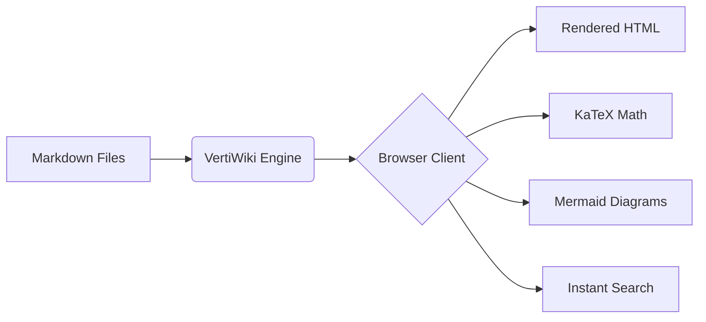
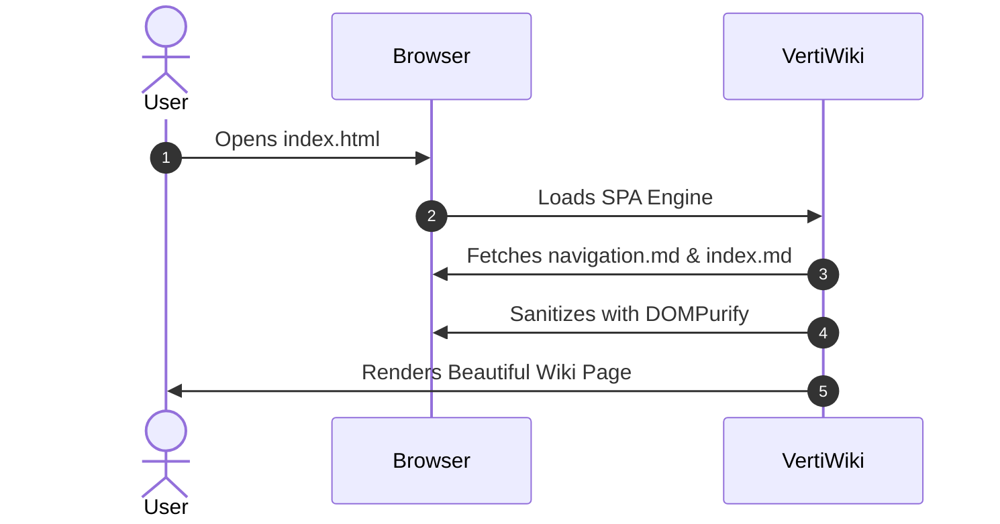

# Math & Mermaid Diagrams

VertiWiki comes with built-in support for **KaTeX** math formulas and **Mermaid.js** diagrams.

---

## 1. LaTeX Math with KaTeX

You can render mathematical equations inline using `$formula$` or as standalone display blocks using `$$formula$$`.

### Inline Math Examples
* The mass-energy equivalence is given by $E = mc^2$.
* The quadratic formula is $x = \frac{-b \pm \sqrt{b^2 - 4ac}}{2a}$.
* Euler's identity: $e^{i\pi} + 1 = 0$.

### Display Block Math
$$
\int_{-\infty}^{\infty} e^{-x^2} dx = \sqrt{\pi}
$$

$$
f(x) = \sum_{n=0}^{\infty} \frac{f^{(n)}(a)}{n!} (x - a)^n
$$

---

## 2. Mermaid.js Diagrams

Mermaid diagrams can be written directly inside ` ```mermaid ` code blocks:

### Architecture Flowchart



### Sequence Diagram



---

## 3. Responsive Video Embeds

Paste any YouTube link as a standalone link or markdown anchor, and VertiWiki automatically embeds it with a privacy-friendly, responsive player:

https://www.youtube.com/watch?v=dQw4w9WgXcQ
