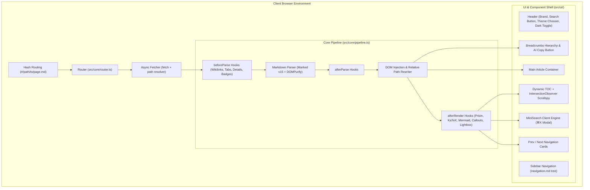

# Technical Architecture & Core Overview

**VertiWiki 0.3.0** is an ultra-fast, zero-backend, single-file Markdown wiki and documentation engine. This document details the internal architecture, lifecycle pipeline, and bundling mechanics.

---

## 🏗️ High-Level System Architecture



---

## 🔄 Page Render Lifecycle

When a user navigates or the page initially loads, VertiWiki executes the following deterministic lifecycle:

1. **Hash Change Interception**:
   * The `Router` captures `window.location.hash` (e.g. `#/docs/getting-started/installation.md#step-2`).
   * Normalizes the path and parses any section anchor.
   * If browser supports it, triggers `document.startViewTransition()` for smooth page transitions.

2. **Fetching Content**:
   * Fetches the raw Markdown file asynchronously via native `fetch()`.
   * If the file returns HTTP 404, attempts to load `404.md` as a graceful fallback.

3. **Frontmatter & Metadata Extraction**:
   * Scans for YAML frontmatter (`--- ... ---`).
   * Extracts page metadata, title, author, description, tags, and optional per-page theme preset overrides (`theme: terracotta`).

4. **Pipeline: `beforeParse`**:
   * Passes the raw Markdown string through all registered plugins (Wikilinks, Tabs, Details accordions, Badges, Callouts) for pre-processing.

5. **Parsing & Sanitization**:
   * Parses Markdown to HTML using **Marked v15** with GFM tables, task lists, and auto-slugified heading anchors.
   * Sanitizes all HTML using **DOMPurify** to guarantee 100% protection against XSS attacks.

6. **Pipeline: `afterParse`**:
   * Allows plugins to inspect or mutate the sanitized HTML string prior to DOM injection.

7. **DOM Injection & Relative Link / Media Resolution**:
   * Injects HTML into `<article id="cortex-content">`.
   * Updates page title (`<title>`) and injects dynamic Schema.org JSON-LD graph (`TechArticle`, `BreadcrumbList`) for AI answer engines.
   * Renders breadcrumbs path at the top of the article.
   * Runs `router.transformLinks(container, currentFilePath)`:
     * Rewrites all relative markdown links (`[Title](../guide.md)`) into hash routes (`#/path/guide.md`).
     * Rewrites relative image paths (``) to full paths (`docs/pic.png`).

8. **Pipeline: `afterRender`**:
   * **Callouts Plugin**: Transforms `> [!NOTE]`, `> [!TIP]`, `> [!WARNING]`, etc. into visual alert cards.
   * **Code Highlight Plugin**: Highlights syntax with Prism and attaches language badges + Copy buttons.
   * **KaTeX Plugin**: Renders inline `$formula$` and block `$$formula$$` equations.
   * **Mermaid Plugin**: Compiles ` ```mermaid ` code blocks into SVG diagrams.
   * **Lightbox Plugin**: Adds zoomable modal functionality to all images and diagrams.
   * **Tabs & Details Plugins**: Attaches event listeners for active tab switching.

9. **TOC & Scrollspy**:
   * Scans article for `<h2>` and `<h3>` tags.
   * Rebuilds right sidebar Table of Contents.
   * Attaches an `IntersectionObserver` to highlight the active section as the user scrolls.

10. **Incremental Search Indexing & Prev/Next**:
    * Pushes the rendered page content to the in-memory **MiniSearch** index for instant lookup.
    * Updates sequential Previous and Next page cards at the bottom of the article.

---

## 📦 Single-File Bundling Mechanics

VertiWiki uses **Vite 6** paired with `vite-plugin-singlefile`:
* All TypeScript files, styles, KaTeX fonts, Prism syntaxes, and SVG icons are inlined directly into a single standalone HTML artifact: `dist/vertiwiki.html`.
* The resulting file can be placed in any directory alongside Markdown files without needing an external web server or build pipeline during runtime.
