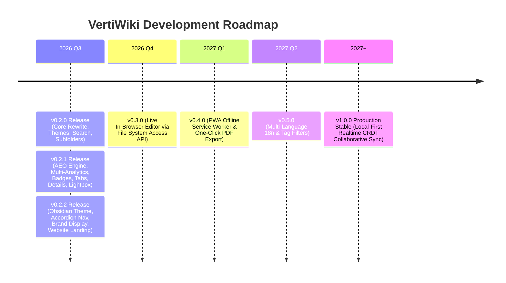

# Versioning Policy & Future Roadmap

This document outlines the versioning strategy, historical changelog, and future development roadmap for **VertiWiki**.

---

## 🏷️ Versioning Strategy

VertiWiki adheres strictly to **Semantic Versioning 2.0.0 (SemVer)**:
`MAJOR.MINOR.PATCH`

* **MAJOR (`v1.0.0`, `v2.0.0`)**: Incompatible architectural rewrites or breaking API changes.
* **MINOR (`v0.2.0`, `v0.3.0`)**: Backward-compatible new features, new plugins, new theme presets, or config extensions.
* **PATCH (`v0.2.1`, `v0.2.2`)**: Backward-compatible bug fixes, security patches, and performance optimizations.

---

## 📜 Version History

### **v0.2.5** (Current Active Release — August 2026) :badge[Latest]{type=success}
* 🏷️ **Static HTML Title vs. Dynamic Configuration**: Clarified client-side dynamic `config.title` vs. raw static `<title>` tag fallback in deployment and SEO guides.
* 📚 **Synchronized Documentation Standards**: Aligned documentation protocols for dual-repository distributions.

---

### **v0.2.4** (August 2026)

---

### **v0.2.3** (August 2026)
* 🎨 **Modular External Theme Files**: Custom themes can now live in dedicated `.json` files in `themes/` (e.g. `themes/obsidian.json`) and referenced in `config.json`.
* 🧹 **Streamlined `config.json`**: Reduced configuration footprint from 70+ lines to ~20 lines.
* ⚡ **Polymorphic Theme Loader**: Asynchronously resolves external theme files, single file path strings, and legacy inline theme objects with robust fallback handling.
* 🛡️ **Pure `verti-` Namespace**: Unified prefix across all CSS variables (`--verti-*`), DOM containers (`#verti-app`), UI components, and all 13 plugins.

---

### **v0.2.2** (August 2026)
* ⚡ **Flexible Brand Header**: Support for logo-only, text-only, or both logo and title in header via `brandDisplay: "both" | "logo" | "title"`.
* 📂 **Collapsible Sidebar Accordions**: Smart accordion folders in navigation tree with auto-expansion of active article branch (`collapsibleNavigation: true`).
* 🎨 **Obsidian Framework Theme**: Full support for custom zero-recompile themes with dynamic Google Fonts injection.
* 🌐 **Product Landing Showcase**: Standalone developer landing page and distribution suite in `website/`.

---

### **v0.2.1** (August 2026)
* 📑 **Interactive Code Tabs**: Added `::: tabs` and `::: code-group` multi-language switchers.
* 📂 **Collapsible Details & FAQs**: Added `::: details` accordion blocks.
* 🔍 **Image & Diagram Lightbox**: Fullscreen zoom modal on image click.
* 🔀 **Prev / Next Article Navigation**: Auto-generated sequential reading cards.
* 🤖 **Dynamic Zero-Build AEO Engine**: In-memory Schema.org JSON-LD graph generation (`TechArticle`, `BreadcrumbList`, `WebSite`).
* 📝 **Jekyll / Astro Style Frontmatter**: Native YAML metadata support with automatic smart fallback deduction.
* ⚡ **1-Click "Copy for AI" Action**: Context exporter for ChatGPT, Claude, and Perplexity prompts.
* 📊 **Universal Multi-Provider Analytics**: Dynamic zero-recompile tracking for GA4, GTM, Plausible, Cloudflare, Umami, and Matomo.
* 🏷️ **Badges & Tags Plugin**: Added `:badge[Text]{type=...}`.
* 📄 **Standard `llms.txt` & AI `robots.txt`**: Discovery index for LLM crawlers.

---

### **v0.2.0** (August 2026)
* ⚡ **Complete Architecture Rewrite**: Greenfield modern rewrite with **Vite 6, TypeScript 5.7+, Node 22+**, and ESM.
* 📦 **Single-File Distribution**: Bundles into standalone `dist/vertiwiki.html`.
* 🛡️ **Zero-XSS Guarantee**: Strict sanitization with **DOMPurify**.
* 🎨 **Multi-Theme Engine**: 7 presets (Warm Terracotta, Forest Emerald, Nord, Dracula, Amethyst, Editorial, Modern Indigo).
* 📁 **Subfolder & Hierarchical Support**: Automatic relative path calculation and dynamic breadcrumbs.
* 🔍 **Instant Full-Text Offline Search**: Client-side indexer with fuzzy matching (**MiniSearch**).
* 📐 **KaTeX & Mermaid.js**: Built-in math formulas and interactive diagrams.

---

## 🗺️ Development Roadmap

